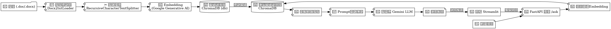

# rag_demo🤖 员工手册 RAG 问答机器人(0成本版)


> 一个基于 RAG（Retrieval-Augmented Generation）技术的问答系统。支持上传内部文档，结合大模型，实现精准的基于知识的问答。前端使用 Streamlit，后端基于 FastAPI，向量数据库采用 ChromaDB，Embedding 和大模型使用 Google Gemini API。

---

## 🚀 功能介绍

- ✅ 支持上传 Word（.docx）文件，自动解析
- ✅ 文档切割成文本块，转换为向量，存储到本地向量数据库
- ✅ 前端用户输入问题
- ✅ FastAPI 后端接收请求，调用向量数据库检索相关内容
- ✅ 利用 Google Gemini Embedding 和 LLM 结合上下文生成答案
- ✅ 展示引用来源（文档和页码）

---

## 🏗️ 系统架构



---

## 🗂️ 项目结构

```
.
├── documents/          # 存放原始文档（.docx）
├── db/                 # 本地向量数据库（持久化）
├── ingest.py           # 数据入库脚本（离线向量构建）
├── main.py             # FastAPI 后端服务
├── frontend.py         # Streamlit 前端
├── .env                # 环境变量（存储 Google API Key）
├── requirements.txt    # Python 依赖
├── README.md           # 项目说明
```

---

## 🔧 快速开始

### 1️⃣ 克隆项目

```bash
git clone https://github.com/zxyphp/rag_demo.git
cd rag_demo
```

### 2️⃣ 安装依赖

建议创建虚拟环境：

`推荐 Anaconda`

安装依赖：

```bash
pip install -r requirements.txt
```

### 3️⃣ 配置环境变量

创建 `.env` 文件，回归到标题的 0 成本，既然想白嫖，那么就得接受效果差，很差。差不多是那么回事就行。所以这里就用`gemini-1.5-flash`演示。
顺带教大家怎么判断自己的 API Key 可用的模型列表

```bash
python list_models.py
```

自己去申请 Google API Key，填入你的 Google API Key：

```env
GOOGLE_API_KEY=你的GoogleAPIKey
```

👉 Google Gemini API 获取地址： https://aistudio.google.com/app/apikey

---

## 📄 文档向量化（离线处理）

### 📥 将 `.docx` 文件放入 `documents/` 文件夹。

### 运行：

```bash
python ingest.py
```

✅ 成功后会在 `db/` 文件夹下生成向量数据库。

---

## 🚀 启动后端 FastAPI 服务

```bash
uvicorn main:app --reload
```

- 默认地址： http://127.0.0.1:8000
- API 文档： http://127.0.0.1:8000/docs

---

## 🖥️ 启动前端 Streamlit 服务

```bash
streamlit run frontend.py
```

- 打开浏览器访问：http://localhost:8501

---

## 🛠️ 技术栈

| 模块    | 技术                                      |
|---------|-------------------------------------------|
| 前端    | Streamlit                                 |
| 后端    | FastAPI                                   |
| 向量数据库 | ChromaDB (本地持久化)                   |
| 向量模型 | Google Generative AI Embeddings           |
| 大语言模型 | Google Gemini LLM                       |
| 文档加载 | Docx2txtLoader                            |
| 文本切分 | RecursiveCharacterTextSplitter            |

---

## 🎯 使用示例

### ✅ 输入问题：

```
员工手册中的主要功能有哪些？
```

### ✅ 返回答案：

```
    "员工手册涵盖了公司福利
    （住房公积金、年终奖、生日福利、团建福利、节日福利、问诊券）、
    费用报销规定、
    出差规范以及职业素养和规范（仪容仪表、会议规范、环境维护）。",
...
```

### ✅ 引用文档：

```
[
    {
        "source": "documents/员工手册V2.1.docx",
        "page": "未知页码"
    },
    {
        "source": "documents/员工手册V2.1.docx",
        "page": "未知页码"
    },
    {
        "source": "documents/员工手册V2.1.docx",
        "page": "未知页码"
    }
]
```

---

## 🧠 工作原理

1️⃣ 离线阶段：

- 文档加载 → 文本切分 → 生成 Embedding → 存储到 ChromaDB

2️⃣ 在线查询：

- 用户输入 → 生成问题向量 → 向量数据库检索 → 获取相似文档
- 构建 Prompt → 调用 Gemini LLM → 返回答案

---

## 📦 requirements.txt 示例

```txt
fastapi
uvicorn
langchain
langchain-community
langchain-google-genai
unstructured
python-docx
chromadb
pypdf
python-dotenv
```

---

## 🏗️ 未来计划

- [ ] 支持更多文件格式（PDF、TXT）
- [ ] 支持多语言问答
- [ ] 支持 Docker 一键部署
- [ ] 增加用户权限管理

---

## ❤️ 致谢

- [LangChain](https://github.com/langchain/langchain)
- [ChromaDB](https://github.com/chroma-core/chroma)
- [Google Gemini API](https://aistudio.google.com/)
- [Streamlit](https://streamlit.io/)
- [FastAPI](https://fastapi.tiangolo.com/)

---

## 🚀 Star 一下，持续更新！

如果觉得有帮助，欢迎点一个 ⭐️ Star！


